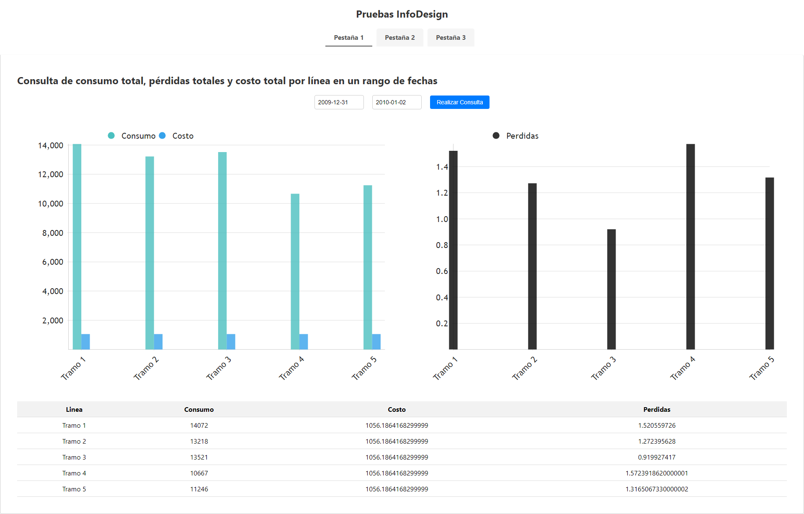
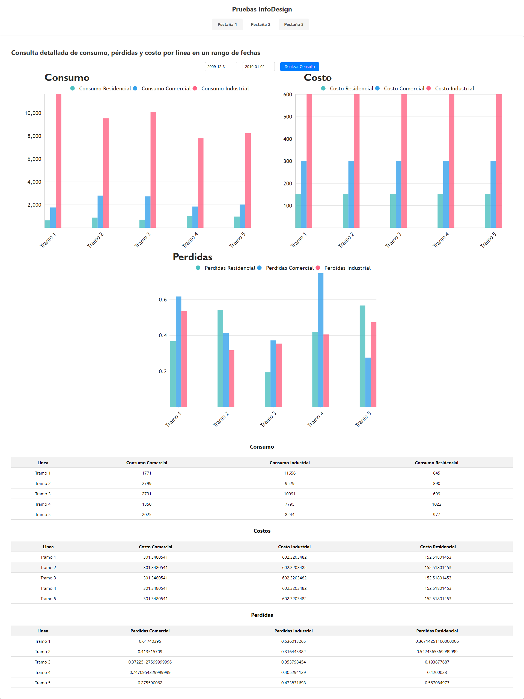
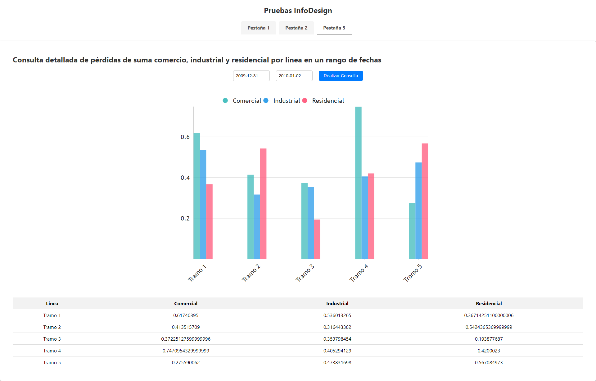

# pruebaInfoDesign

En este repositorio se encuentran alojados los desarrollos front-end y back-end de la prueba técnica.

## Comenzando 🚀

Instrucciones generales de cómo ejecutar los proyectos de forma local.

### Pre-requisitos 📋

Para poder ejecutar los proyectos de forma local, es necesario tener instalados los siguientes programas:

Git: para clonar los repositorios.
Visual Studio Code (o cualquier otro editor de texto de preferencia).
mySql: motor de base de datos
Node.js: lenguaje de programación necesario para ejecutar las aplicaciones.

### Instalación 🔧

Asumiendo que se tienen instalados los programas mencionados anteriormente, a continuación se describe el paso a paso para desplegar los proyectos de forma local:

Clonar los repositorios en una carpeta de tu equipo:

Front-end (my-app): git clone [https://github.com/DavidDHerrera/InfoDesign.git] my-app
Back-end (pruebatecnicainfodesignback): git clone [https://github.com/DavidDHerrera/InfoDesign.git] pruebatecnicainfodesignback
Para cada repositorio, acceder a su carpeta raíz y abrir una consola de comandos. Ejecutar el comando npm install en cada carpeta para instalar las dependencias necesarias.

Una vez finalizado el proceso de instalación, ejecutar el comando npm start en cada carpeta para iniciar los proyectos.

## Explicación ⚙️
Al iniciar la aplicación de la carpeta donde esta alojado el back arrojara "Servidor en puerto 4000"

Al iniciar la aplicación en la carpeta donde esta alojado el front arrojara "El servidor se encuentra en el puerto 3000"

En el Navegador aparecera una pagina principal con 3 pestañas las cuales se podra visualizar las graficas correspondientes que trae desde back con sus respectibas tablas con filtros

## Contenido ⚙️
La Pestaña 1 mostrara los tramos consumos, perdidas y costos que es la consulta 1

La Pestaña 2 mostrara los tramos consumos, perdidas y costos divididas por tipos de usuarios, hice una grafica y una tabla por cada tipo

La Pestaña 3 mostrara Consulta detallada de pérdidas de suma comercio, industrial y residencial por línea en un rango de fechas, sta consulta la modifique un poco para poder hacer una grafica mas detallada con respecto a las perdidas, sume las perdidas segun los tramos en los que se encontraba.

## Construido con 🛠️

* [React](https://react.dev/)
* [Node JS](https://nodejs.org/es/)
